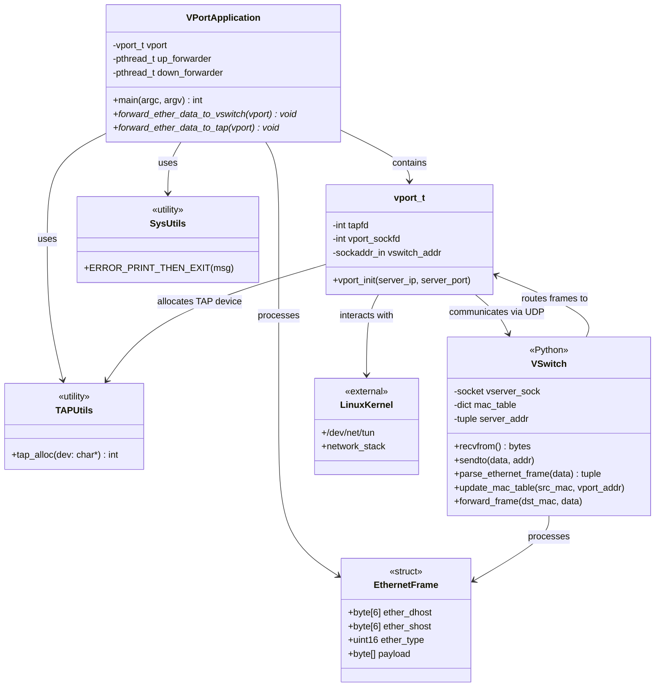
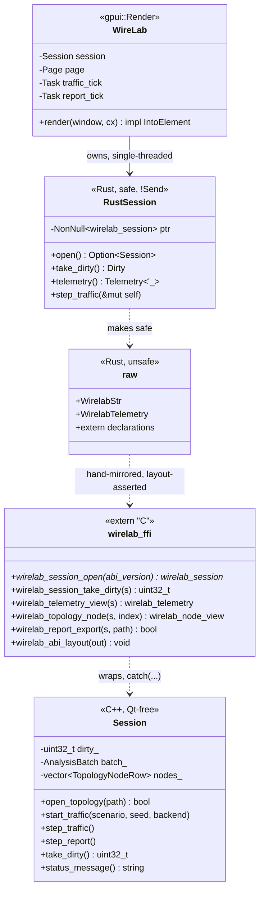

# Class Diagram - VPN Virtual Switch Architecture

## Overview
This diagram shows the structure and relationships of the virtual switch components.

> The dataplane diagram below documents the original C/Python prototype the
> project started from. The shipped dataplane is C++ (`src/vswitch.cpp`,
> `src/vport.cpp`); see `docs/architecture-overview.md`. The frontend section at
> the end of this file documents the current desktop stack.

## Component Descriptions

### VPort Components (C)

#### vport_t
The main VPort structure that maintains:
- **tapfd**: File descriptor for the TAP device (connection to Linux kernel)
- **vport_sockfd**: UDP socket for communication with VSwitch
- **vswitch_addr**: Address information for the VSwitch server

#### VPortApplication
The main application that:
- Creates and initializes a VPort instance
- Spawns two forwarding threads:
  - **up_forwarder**: Forwards ethernet frames from TAP device to VSwitch
  - **down_forwarder**: Forwards ethernet frames from VSwitch to TAP device

#### TAPUtils
Utility module for TAP device management:
- **tap_alloc()**: Allocates and configures a TAP device (IFF_TAP | IFF_NO_PI)

#### SysUtils
System utility macros:
- **ERROR_PRINT_THEN_EXIT**: Error handling macro for fatal errors

### VSwitch Component (Python)

#### VSwitch
A learning switch implementation that:
- Listens on UDP socket for ethernet frames from VPorts
- Maintains a MAC address table mapping MAC addresses to VPort addresses
- Forwards frames based on destination MAC:
  - Unicast: Forward to specific VPort if MAC is in table
  - Broadcast (ff:ff:ff:ff:ff:ff): Forward to all VPorts except source
  - Unknown: Discard frame

### Data Structures

#### EthernetFrame
Standard Ethernet II frame structure:
- 6-byte destination MAC address
- 6-byte source MAC address
- 2-byte EtherType field
- Variable-length payload

## Architecture Notes

1. **TAP Device**: Virtual network interface that appears as a real network device to the Linux kernel
2. **UDP Communication**: VPorts communicate with VSwitch using UDP sockets for low-latency frame forwarding
3. **MAC Learning**: VSwitch learns MAC-to-VPort mappings dynamically
4. **Threading**: Each VPort uses two threads for bidirectional forwarding

## Desktop Frontend and the FFI Boundary

The frontend is a separate process image in a separate language, so the boundary
between them is a contract rather than a call graph. Three layers, one direction:
the C++ side never calls into Rust, and Rust never touches a dataplane type.

### Session (`include/wirelab/session.hpp`)

The orchestration every frontend drives: topology editing and radial layout, the
traffic tick, the report state machine, policy and fault commands, YAML/JSON/CSV
export. It has no error returns by design — a failure is a status message the UI
shows, not a code the UI must invent prose for — and no callbacks: every seam is
pull-based, matching the core beneath it.

### wirelab_ffi (`include/wirelab/wirelab_ffi.h`)

A frozen C ABI, versioned by `WIRELAB_FFI_ABI_VERSION` and checked at
`wirelab_session_open`. Two rules the header states and the Rust wrapper
enforces:

- **Thread affinity.** A session belongs to the thread that opened it.
- **Borrow lifetime.** Every string and every span is borrowed from
  session-owned storage and dies at the next mutating call.

Change notification is a poll-and-clear dirty bitmask, so there is no callback
trampoline into Rust in either direction.

### The Rust binding (`gui/src/ffi/`)

`raw.rs` mirrors the header by hand — no `bindgen`, no libclang in CI — and
`wirelab_abi_layout()` reports what the C++ compiler actually produced so
`cargo test` fails on drift rather than reading plausible garbage. `mod.rs`
turns the two header rules into type-system facts: `Session` is neither `Send`
nor `Sync`, getters take `&self` and return values tied to that borrow, and
commands take `&mut self` — so holding a telemetry row across a mutation does
not compile.

### The frontend (`gui/src/`)

GPUI. `WireLab` owns the session and the clock: a 500 ms task steps traffic, a
16 ms task advances a running report, and each drains `take_dirty()` and calls
`cx.notify()` when something moved. The core never advances a simulation on its
own, so the frontend owning the tick is the design, not a convenience.

